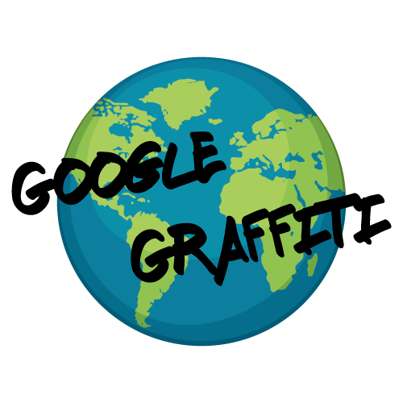

# Google Graffiti

[Google Graffiti](https://teamfirstproject.github.io/GoogleGrafitti/) is a group project for UC Berekely Extended Education coding camp, created by [Dennis Tam](https://github.com/saikay), [Harry Neakok](https://github.com/Harryneakok), [Joshua Moore](https://github.com/joshmoore2003), and [Justin Honegger](https://github.com/Skarrggit).

The goal of the project was to make a simple, location-based chat program. To accomplish this, we used Google API and Firebase as a chat backend.

The user can click on any of the Google Maps markers existing on the screen and enter a chat room for that location. They can also click on the map to create a new marker and chat room.

Supplementary links:

-[Project Presentation](https://docs.google.com/presentation/d/1Rwv2XuF_TnyRve9qnTL6SF9_FZHvjptNy1e0zz0J4PU/edit?userstoinvite=hcneakok@gmail.com&ts=5be3a2f7&actionButton=1#slide=id.g46cca724e4_0_131)
-[Trello Board](https://trello.com/b/7Sr8nISU/project-tasks)
-[Project Proposal Document](https://docs.google.com/document/d/1v7cyyp4mj83Fq8L1GIzlf53qp43P5S8eSyHVPy8vhm4/edit#heading=h.2gazcsgmxkub)